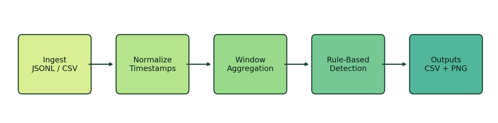
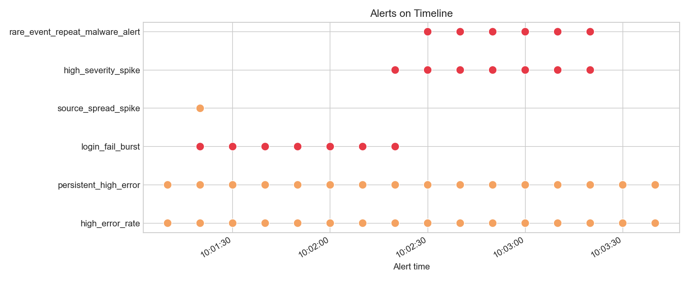

# telemetry-window-demo

A small monitoring and detection prototype that turns timestamped event streams into windowed telemetry features, simple alerts, and operator-friendly outputs.

## Summary

`telemetry-window-demo` is a minimum credible asset for a broader `telemetry-lab` portfolio. It is intentionally small, but it proves three transferable capabilities:

- ingest structured event streams instead of static datasets
- apply sliding-window analytics on time-aware signals
- translate features into monitoring and alerting outputs

The point is not to build a SIEM. The point is to show that time-series preprocessing and aggregation skills can be translated into detection-oriented telemetry work.

In one sentence: this repository treats structured operational events as time-aware signals, then turns those signals into monitoring features and simple alert decisions.

## Why this project

Operational systems produce timestamped events, not neatly prepared tables. This project demonstrates a lightweight but complete loop:

1. load local JSONL or CSV events
2. normalize timestamps and categorical fields
3. build sliding windows
4. compute window-level telemetry features
5. trigger rule-based alerts
6. export analyst-friendly CSV outputs and plots

That is enough to move the narrative from "I did a class notebook" to "I built a time-aware telemetry analytics prototype."

## Core questions this repo answers

- What is the input event schema?
- How are windows defined?
- Which features are computed?
- What conditions trigger alerts?
- How are results exported for operators or reviewers?

## Repository structure

```text
telemetry-window-demo/
├─ README.md
├─ LICENSE
├─ pyproject.toml
├─ requirements.txt
├─ .gitignore
├─ data/
│  ├─ raw/
│  │  └─ sample_events.jsonl
│  └─ processed/
│     ├─ features.csv
│     └─ alerts.csv
├─ src/
│  └─ telemetry_window_demo/
│     ├─ __init__.py
│     ├─ io.py
│     ├─ schema.py
│     ├─ preprocess.py
│     ├─ windowing.py
│     ├─ features.py
│     ├─ rules.py
│     ├─ visualize.py
│     └─ cli.py
├─ notebooks/
│  └─ exploratory_demo.ipynb
├─ configs/
│  └─ default.yaml
├─ tests/
│  ├─ test_io.py
│  ├─ test_pipeline_e2e.py
│  ├─ test_windowing.py
│  └─ test_rules.py
├─ assets/
│  ├─ pipeline.png
│  └─ example_alert_timeline.png
└─ docs/
   ├─ design-notes.md
   └─ sample-output.md
```

## Input schema

Required fields:

- `timestamp`
- `event_type`
- `source`
- `target`
- `status`

Recommended fields:

- `severity`
- `user`
- `host`
- `ip`

Optional field:

- `metadata`

Primary input format is `JSONL`, with `CSV` also supported.

Example:

```json
{"timestamp":"2026-03-10T10:00:01Z","event_type":"login_success","source":"user_a","target":"auth_service","status":"ok","severity":"low"}
{"timestamp":"2026-03-10T10:00:07Z","event_type":"login_fail","source":"user_b","target":"auth_service","status":"fail","severity":"medium"}
{"timestamp":"2026-03-10T10:00:12Z","event_type":"config_change","source":"admin_x","target":"iam_policy","status":"ok","severity":"high"}
```

## Windowing model

Default configuration uses a sliding window:

- `window_size_seconds: 60`
- `step_size_seconds: 10`

Each window is treated as `[window_start, window_end)`. This is enough to support lightweight monitoring analytics without pretending to be a real streaming engine.

## Computed features

Every window includes:

- `event_count`
- `error_count`
- `error_rate`
- `unique_sources`
- `unique_targets`
- `high_severity_count`
- configured event-type counts such as `login_fail_count`

This gives the project a detection-oriented vocabulary instead of a generic time-series vocabulary.

## Detection rules

The default config ships with simple rule-based logic:

- `high_error_rate`
- `login_fail_burst`
- `high_severity_spike`
- `persistent_high_error`
- `source_spread_spike`
- `rare_event_repeat`

These rules are intentionally simple. They exist to show alerting semantics, not model sophistication.

## Quick start

```bash
python -m pip install -e .
```

Single end-to-end MVP command:

```bash
python -m telemetry_window_demo.cli run --config configs/default.yaml
```

That command replays the bundled sample dataset and regenerates the checked-in CSV outputs and timeline plots under `data/processed/`.

Additional commands:

```bash
python -m telemetry_window_demo.cli summarize --input data/raw/sample_events.jsonl
python -m telemetry_window_demo.cli plot --features data/processed/features.csv --alerts data/processed/alerts.csv
```

## Outputs

The pipeline writes three operator-facing artifacts:

- `data/processed/features.csv`
- `data/processed/alerts.csv`
- timeline plots under `data/processed/`

The intended message is:

**signals become features, features become alerts**

## Example output tables

Representative rows from `features.csv`:

```csv
window_start,window_end,event_count,error_count,error_rate,unique_sources,unique_targets,high_severity_count,login_fail_count
2026-03-10T10:00:00Z,2026-03-10T10:01:00Z,10,3,0.30,8,4,1,3
2026-03-10T10:00:10Z,2026-03-10T10:01:10Z,10,6,0.60,8,4,1,6
2026-03-10T10:00:20Z,2026-03-10T10:01:20Z,13,10,0.77,11,3,0,10
```

Representative rows from `alerts.csv`:

```csv
alert_time,rule_name,severity,window_start,window_end,message
2026-03-10T10:01:10Z,high_error_rate,medium,2026-03-10T10:00:10Z,2026-03-10T10:01:10Z,error_rate 0.60 exceeded 0.30
2026-03-10T10:01:20Z,login_fail_burst,high,2026-03-10T10:00:20Z,2026-03-10T10:01:20Z,"login_fail_count reached 10, threshold is 8"
2026-03-10T10:01:20Z,persistent_high_error,medium,2026-03-10T10:00:20Z,2026-03-10T10:01:20Z,error_rate stayed above 0.25 for 2 windows
```

These outputs are intentionally plain. They are meant to be inspectable by an analyst, easy to diff in git, and easy to feed into a later dashboard or detection pipeline.

## Example visuals

Pipeline overview:



Alert timeline from the bundled sample:



## Configuration

The repo includes a minimal YAML config in [`configs/default.yaml`](configs/default.yaml):

```yaml
input_path: data/raw/sample_events.jsonl
output_dir: data/processed

time:
  timestamp_col: timestamp
  window_size_seconds: 60
  step_size_seconds: 10
```

Thresholds and counted event types are configurable without touching code.

## CLI example output

```text
[OK] Loaded 41 events
[OK] Generated 24 windows
[OK] Computed 11 features per window
[OK] Triggered 53 alerts
[OK] Saved features.csv, alerts.csv
[OK] Saved plots to data/processed
```

## Design principles

- small enough to read in one sitting
- structured like a real repository, not a single notebook
- focused on time-aware operational signals
- explicit about limitations
- notebook is optional scratch space, not the main product

## Limitations

This repository is a toy demo for learning and portfolio use.

- no real-time ingestion
- no stateful stream processor
- no alert routing or on-call integration
- no SIEM or SOC platform integration
- no production hardening or storage layer

The value is credibility, not completeness.

## Future work

- add streaming input mode
- add anomaly scoring beside threshold rules
- support richer schemas and more event families
- emit outputs that can be consumed by a dashboard
- fold this into a larger `telemetry-lab` monorepo

## Skill translation

This repo is deliberately framed as a bridge:

| Previous skill | Telemetry translation |
| --- | --- |
| timestamp alignment | timestamp normalization |
| time slicing | windowing |
| summary statistics | aggregate telemetry features |
| anomaly identification | rule-based detection |
| trend visualization | monitoring timeline |
| multivariate features | event-derived features |
| interpretation | alert review |

## Glossary

- telemetry: operational signal data
- event stream: ordered timestamped events
- sliding window: overlapping fixed-size time windows
- aggregation: reduce events into metrics
- alerting: convert metrics into human-actionable signals
- observability: understanding system behavior through emitted signals
