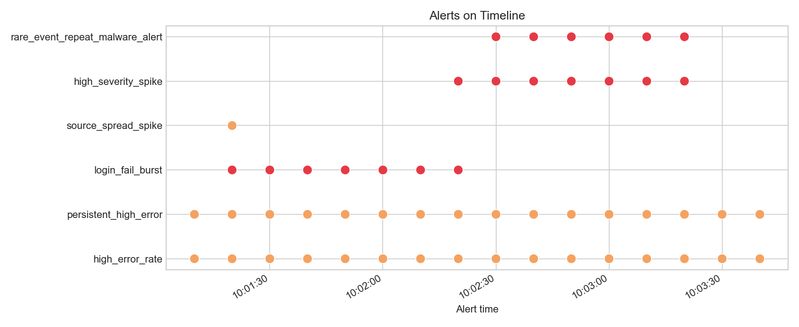

# telemetry-lab

[](https://github.com/stacknil/telemetry-lab/actions/workflows/ci.yml)

A local, file-based detection workflow lab for reviewer-verifiable telemetry and detection demos.

Latest milestone: [v0.6.0 — fourth demo and config-change investigation](https://github.com/stacknil/telemetry-lab/releases/latest).

## Demos

- [telemetry-window-demo](#telemetry-window-demo)
- [ai-assisted-detection-demo](demos/ai-assisted-detection-demo/README.md)
- [rule-evaluation-and-dedup-demo](demos/rule-evaluation-and-dedup-demo/README.md)
- [config-change-investigation-demo](demos/config-change-investigation-demo/README.md)

| Demo | Input | Deterministic core | LLM role | Main artifacts | Guardrails / non-goals |
| --- | --- | --- | --- | --- | --- |
| [telemetry-window-demo](#telemetry-window-demo) | JSONL / CSV events | Windows<br>Features<br>Alert thresholds | None | `features.csv`<br>`alerts.csv`<br>`summary.json`<br>3 PNG plots | MVP only<br>No realtime<br>No case management |
| [ai-assisted-detection-demo](demos/ai-assisted-detection-demo/README.md) | JSONL auth / web / process | Normalize<br>Rules<br>Grouping<br>ATT&CK mapping | JSON-only case drafting | `rule_hits.json`<br>`case_bundles.json`<br>`case_summaries.json`<br>`case_report.md`<br>`audit_traces.jsonl` | Human verification required<br>No autonomous response<br>No final verdict |
| [rule-evaluation-and-dedup-demo](demos/rule-evaluation-and-dedup-demo/README.md) | JSON raw rule hits | Scope resolution<br>Cooldown grouping<br>Suppression reasoning | None | `rule_hits_before_dedup.json`<br>`rule_hits_after_dedup.json`<br>`dedup_explanations.json`<br>`dedup_report.md` | No realtime<br>No dashboard<br>No AI stage |
| [config-change-investigation-demo](demos/config-change-investigation-demo/README.md) | JSONL config changes<br>Policy denials<br>Follow-on events | Normalize<br>Risky-change rules<br>Bounded correlation | None | `change_events_normalized.json`<br>`investigation_hits.json`<br>`investigation_summary.json`<br>`investigation_report.md` | No realtime<br>No dashboard<br>No AI stage |

## What This Repo Is

`telemetry-lab` is a small portfolio repository for constrained detection workflows. It is not a SIEM, dashboard, or monitoring platform; it is organized as four local, file-based demos that are reproducible from committed sample data and intentionally scoped for public review rather than production use.

### telemetry-window-demo

`telemetry-window-demo` turns timestamped event streams into sliding-window feature tables, cooldown-reduced rule-based alerts, PNG timeline plots, and machine-readable run summaries.

### ai-assisted-detection-demo

`ai-assisted-detection-demo` uses deterministic normalization, detection, case grouping, and ATT&CK mapping, then limits the LLM to JSON-only case summarization. Human verification is required, there is no autonomous response, and the demo does not produce a final incident verdict.

### rule-evaluation-and-dedup-demo

`rule-evaluation-and-dedup-demo` starts from raw rule hits and makes cooldown behavior legible. It shows which hits were kept, which were suppressed, how scope was resolved, and why repeated hits collapsed into fewer retained alerts.

### config-change-investigation-demo

`config-change-investigation-demo` follows risky configuration changes into bounded follow-on evidence such as policy denials and service signals. It stays deterministic, file-based, and review-oriented, with no added AI stage.

## Quick Run

```bash
python -m pip install -e .
python -m telemetry_window_demo.cli run --config configs/default.yaml
```

Use the same Python interpreter for install, tests, and demo commands. On machines with multiple Python installs, replace `python` with the intended interpreter path.
To run the test suite in a fresh environment, install the dev extra with `python -m pip install -e ".[dev]"`.

Other demo entrypoints:

- `python -m telemetry_window_demo.cli run-ai-demo`
- `python -m telemetry_window_demo.cli run-rule-dedup-demo`
- `python -m telemetry_window_demo.cli run-config-change-demo`

Useful inspection commands:

- `python -m telemetry_window_demo.cli summarize --input data/raw/sample_events.jsonl`

For CSV inputs, pass a `.csv` file to `--input`; use `--timestamp-col` when the timestamp column is not named `timestamp`.

The `run --config configs/default.yaml` command reads `data/raw/sample_events.jsonl` and regenerates:

- `data/processed/features.csv`
- `data/processed/alerts.csv`
- `data/processed/summary.json`
- `data/processed/event_count_timeline.png`
- `data/processed/error_rate_timeline.png`
- `data/processed/alerts_timeline.png`

With the bundled default sample, the current repo state produces:

- `41` normalized events
- `24` windows
- `12` alerts after a `60` second cooldown

Why it is worth a quick look:

- it shows a full telemetry path from raw events to operator-facing outputs
- the sample inputs and outputs are reproducible in-repo
- a second bundled scenario gives a slightly richer walkthrough without changing the basic CLI flow



## Reviewer Path

For a quick coherence pass across the demos:

1. Run `python -m telemetry_window_demo.cli run --config configs/default.yaml` and confirm `data/processed/summary.json` reports `41` events, `24` windows, and `12` alerts.
2. Run `python -m telemetry_window_demo.cli run-rule-dedup-demo` and confirm `demos/rule-evaluation-and-dedup-demo/artifacts/dedup_report.md` shows `10` raw hits reduced to `6` retained alerts with `4` suppressions.
3. Run `python -m telemetry_window_demo.cli run-config-change-demo` and confirm `demos/config-change-investigation-demo/artifacts/investigation_report.md` shows `4` normalized changes, `3` risky changes, and `3` investigations.
4. Run `python -m telemetry_window_demo.cli run-ai-demo` and confirm `demos/ai-assisted-detection-demo/artifacts/case_report.md` shows `3` deterministic cases with human verification and no final incident verdict.

## Demo Variants

Default sample:

- config: [`configs/default.yaml`](configs/default.yaml)
- input: `data/raw/sample_events.jsonl`
- outputs: `data/processed/`
- current summary: `41` events, `24` windows, `12` alerts, `summary.json` included

Richer sample:

- config: [`configs/richer_sample.yaml`](configs/richer_sample.yaml)
- input: `data/raw/richer_sample_events.jsonl`
- outputs: `data/processed/richer_sample/`
- current summary: `28` events, `24` windows, `8` alerts, `summary.json` included

## Input Support

Runtime input support:

- `.jsonl`
- `.csv`

Required fields for both formats on every row or record:

- `timestamp` by default, or the column named by `time.timestamp_col` in a run config
- `event_type`
- `source`
- `target`
- `status`

Input and output validation:

- config paths, event inputs, and plot CSV inputs must point to files
- required event fields must be present and non-empty
- custom timestamp columns cannot reuse required event field names
- plot input tables validate required columns, datetime values, numeric ranges, and window bounds

Cooldown behavior:

- repeated alerts are keyed by `(rule_name, scope)`
- scope prefers the first available entity-like field in this order: `entity`, `source`, `target`, `host`
- when no entity-like field is present, cooldown falls back to per-`rule_name` behavior

## Repo Guide

- [`demos/rule-evaluation-and-dedup-demo/README.md`](demos/rule-evaluation-and-dedup-demo/README.md) explains the third demo and links its committed before/after dedup artifacts
- [`demos/config-change-investigation-demo/README.md`](demos/config-change-investigation-demo/README.md) explains the config-change investigation demo and its committed artifacts
- [`docs/reviewer-pack.md`](docs/reviewer-pack.md) is the top-level no-guessing reviewer pack
- [`docs/reviewer-path.md`](docs/reviewer-path.md) maps common review questions to the right demo and artifacts
- [`docs/architecture.md`](docs/architecture.md) diagrams the local file-based detection workflow
- [`docs/sample-output.md`](docs/sample-output.md) summarizes the committed sample artifacts
- [`docs/roadmap.md`](docs/roadmap.md) sketches the v0.7 / v1.0 consolidation direction
- [`data/processed/summary.json`](data/processed/summary.json) captures the default run in machine-readable form
- [`data/processed/richer_sample/summary.json`](data/processed/richer_sample/summary.json) captures the richer scenario pack
- [`tests/`](tests/) keeps regression coverage close to the CLI behavior and windowing logic

## v0.7 / v1.0 Direction

- stabilize the four-demo matrix and avoid broad platform expansion
- freeze reviewer-visible artifact names unless a rename is intentionally coordinated across docs, tests, and sample outputs
- use [`docs/reviewer-pack.md`](docs/reviewer-pack.md) and [`docs/architecture.md`](docs/architecture.md) as the consolidation entrypoints
- add at most one more demo before v1-style consolidation

## Scope

This repository is a portfolio prototype, not a production monitoring system.

## Limitations

- No real-time ingestion
- No streaming state management
- No alert routing or case management
- No dashboard or service deployment
- Sample-data driven only
