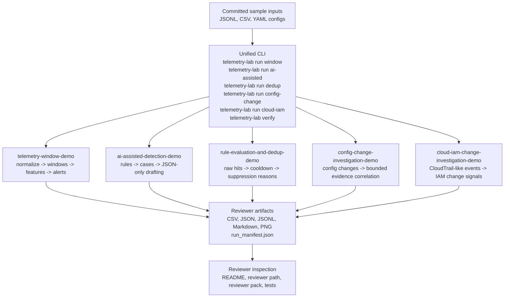

# Architecture

`telemetry-lab` is a local, file-based detection workflow lab. It is organized around committed sample inputs, deterministic demo pipelines, and reviewer-facing artifacts.



## Design Rules

- Detection decisions stay deterministic and inspectable.
- The Python project identity is `telemetry-lab`, the primary import package is `telemetry_lab`, and `telemetry_window_demo` is compatibility-only.
- All primary local runs go through `telemetry-lab run <demo>` and write `run_manifest.json` with `execution_mode: synthetic-local`.
- The AI-assisted demo is limited to bounded JSON-only case drafting.
- Bounded correlation stays inside fixed time windows, fixed entity or scope keys, and fixed event families or rule-local family sets.
- Artifacts are file-based and suitable for local regeneration or GitHub review.
- Artifact names are reviewer-visible contracts during the v1 reviewer contract stabilization phase.
- The repository does not provide production monitoring, real-time ingestion, dashboards, alert routing, case management, autonomous response, or final incident verdicts.
- Notebooks are auxiliary exploration only. The core reviewer pipeline is headless: CLI commands, fixed inputs, committed artifacts, schema validation, and tests.

## Demo Boundaries

| Demo | Boundary |
| --- | --- |
| `telemetry-window-demo` | Converts raw events into window features and alerts; does not become a live stream processor. |
| `ai-assisted-detection-demo` | Drafts constrained summaries from deterministic cases; does not decide incident outcomes or call tools. |
| `rule-evaluation-and-dedup-demo` | Explains cooldown and suppression behavior; does not route alerts. |
| `config-change-investigation-demo` | Correlates risky changes with bounded local evidence; does not monitor live infrastructure. |
| `cloud-iam-change-investigation-demo` | Reviews synthetic CloudTrail-like IAM and cloud-control-plane signals; does not connect to AWS or assert incident verdicts. |

## CLI Contract

Primary commands:

```bash
telemetry-lab run window --config configs/default.yaml
telemetry-lab run ai-assisted
telemetry-lab run dedup
telemetry-lab run config-change
telemetry-lab run cloud-iam
telemetry-lab verify
```

Compatibility commands remain available for older notes and external links:

```bash
python -m telemetry_window_demo.cli run --config configs/default.yaml
python -m telemetry_window_demo.cli run-ai-demo
python -m telemetry_window_demo.cli run-rule-dedup-demo
python -m telemetry_window_demo.cli run-config-change-demo
python -m telemetry_window_demo.cli run-cloud-iam-change-demo
```

The compatibility layer does not define a separate product identity.
