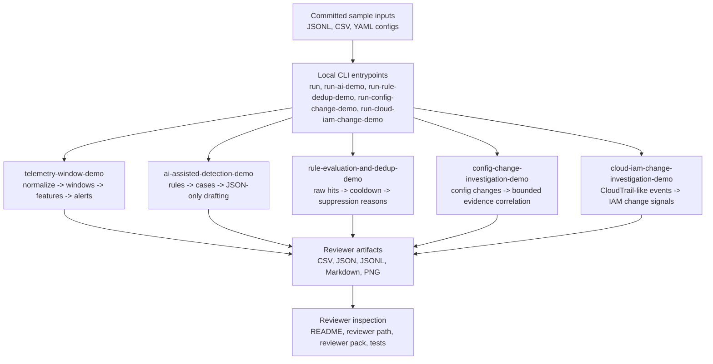

# Architecture

`telemetry-lab` is a local, file-based detection workflow lab. It is organized around committed sample inputs, deterministic demo pipelines, and reviewer-facing artifacts.

## Design Rules

- Detection decisions stay deterministic and inspectable.
- The AI-assisted demo is limited to bounded JSON-only case drafting.
- Artifacts are file-based and suitable for local regeneration or GitHub review.
- Artifact names are reviewer-visible contracts during the v1 reviewer contract stabilization phase.
- The repository does not provide production monitoring, real-time ingestion, dashboards, alert routing, case management, autonomous response, or final incident verdicts.

## Demo Boundaries

| Demo | Boundary |
| --- | --- |
| `telemetry-window-demo` | Converts raw events into window features and alerts; does not become a live stream processor. |
| `ai-assisted-detection-demo` | Drafts constrained summaries from deterministic cases; does not decide incident outcomes or call tools. |
| `rule-evaluation-and-dedup-demo` | Explains cooldown and suppression behavior; does not route alerts. |
| `config-change-investigation-demo` | Correlates risky changes with bounded local evidence; does not monitor live infrastructure. |
| `cloud-iam-change-investigation-demo` | Reviews synthetic CloudTrail-like IAM and cloud-control-plane signals; does not connect to AWS or assert incident verdicts. |
